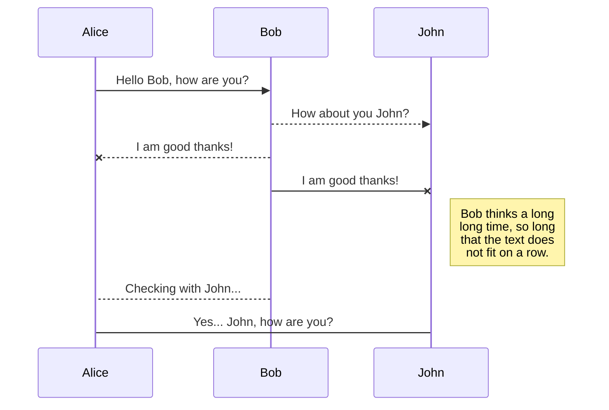

# A serverless guestbook web application and API built with Cloud Functions

The application is a simple guestbook website where users can post messages. It demonstrates how to build a serverless web application where static content is hosted in a storage bucket (here it uses GitHub Pages) and the backend is implemented with Cloud Functions. API Gateway is used to expose the Cloud Functions for the web user interface.

Refer to [this tutorial](https://console.bluemix.net/docs/tutorials/serverless-api-webapp.html) for instructions.

## License

See [License.txt](License.txt) for license information.

